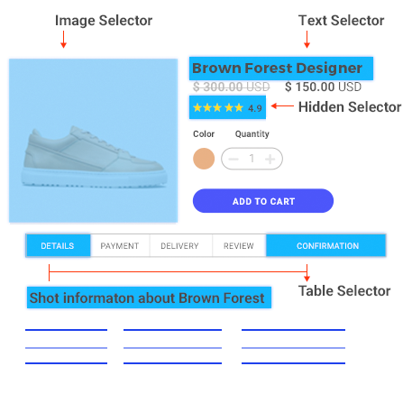
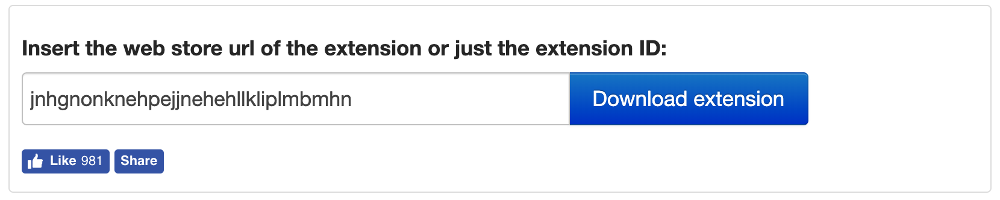
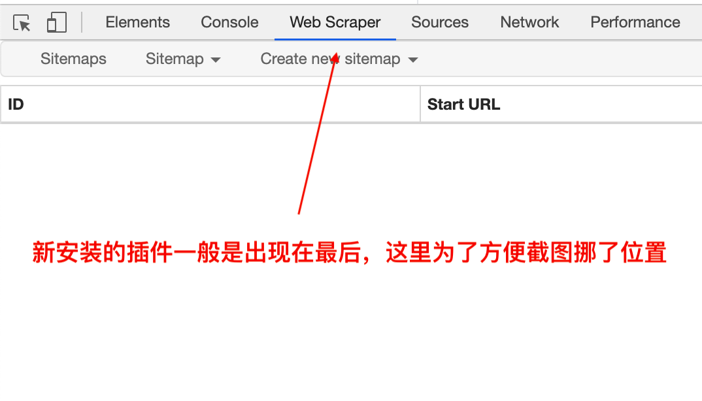

# 快速上手
## Web Scraper 是什么？
[Web Scraper](https://www.webscraper.io/)是一款用于抓取网页数据的 Chrome 插件，只需通过简单的点选操作即可完成抓取配置，无需编写代码。

通过设置导航，Web Scraper 可以动态地从网站各个层级的页面里抓取数据，比如二级分类、分页和商品详情页。

即便是目前构建在 JavaScript 框架之上的现代网站（内容是动态加载的），Web Scraper 也可以优雅地应对：
- JavaScript 完全执行
- 等待 AJAX 异步请求
- 分页处理机制
- 页面滚动处理机制

通过组合各类选择器，Web Scraper 可以针对不同的网站结构定制相应的抓取配置。

完成数据抓取后，可以将其导出为 csv 格式
::: tip
csv 虽简单通用但有缺点，可借助[辅助工具](/tool/)优化）。
:::

## Web Scraper 如何安装？
既然这是个 Chrome 插件，那由于众所周知的原因，[直接安装](https://chrome.google.com/webstore/detail/web-scraper/jnhgnonknehpejjnehehllkliplmbmhn?hl=en)需要自备梯子，不知道什么是梯子的同学那就是没有梯子，安装稍微麻烦一点：
1. 打开这个[网站](https://chrome-extension-downloader.com/)，填入 Web Scraper 的 ID（jnhgnonknehpejjnehehllkliplmbmhn），点击 **Download extension** 将插件下载到自己电脑上，是一个扩展名为 crx 的文件。

2. 打开这个[网站](http://www.webappbus.com/)，按照指示下载 `Chrome插件伴侣` 并安装刚才下载的 `Web-Scraper_v*.*.*.crx`

不管哪种安装方式，当你打开 Chrome 的开发者工具（Windows 按 f12 / Mac 按 command + alt + i），在最后看到 `Web Scraper` 选项卡时就表示安装成功啦~

## Web Scraper 如何使用？
文字不如图，图不如视频，下面是官方的三个视频教程，已加上双语字幕方便食用，追求原汁原味的同学请移步[官方页面](https://www.webscraper.io/tutorials)，当你看完并掌握之后，已足够应对 95% 的网站，希望了解更多细节可以查看[完整教程](/tutorial/)，[辅助工具](/tool/)也很有必要了解一下。

1. [快速上手](https://www.bilibili.com/video/av55260570/)
2. 分页抓取（翻译中）
3. 多记录抓取（翻译中）

(。・∀・)ノ 那我什么都不想学只想直接用呢？

(╯‵□′)╯︵┻━┻ 我反手就是……也可以吧，[抓取配置](/sitemap/)里包含了常见网站的抓取配置，导入后就能直接开始抓取，更多网站将逐步添加，有兴趣有能力的同学请 [GitHub](https://github.com/onedayl/wst) PR 走起~
