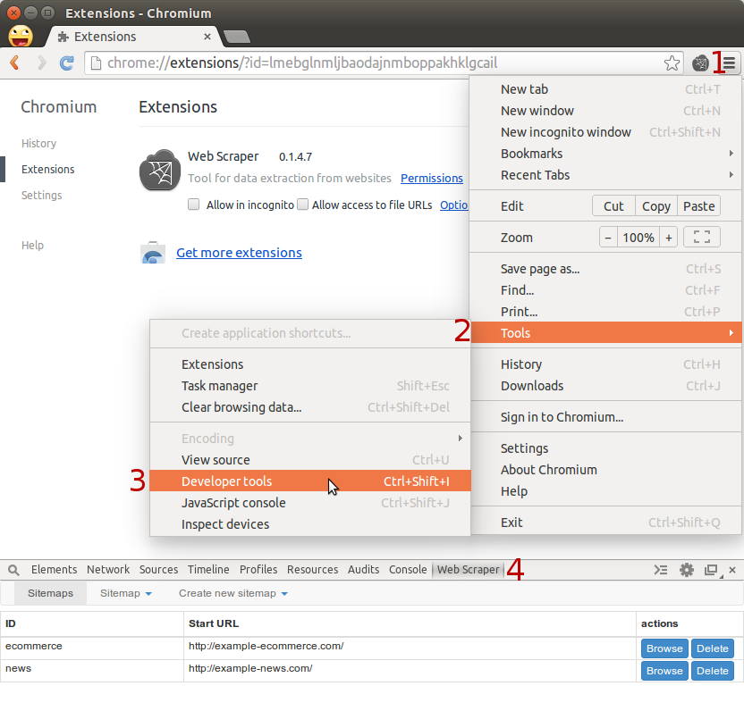
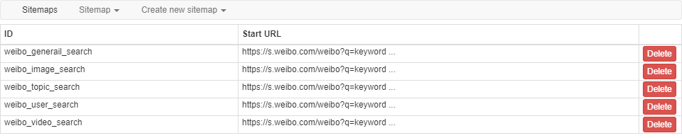
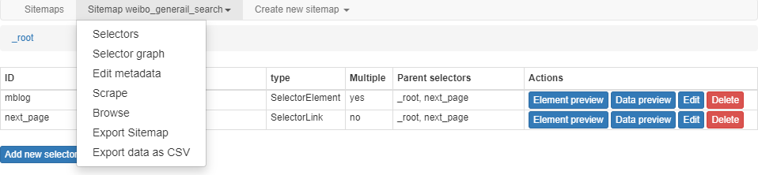
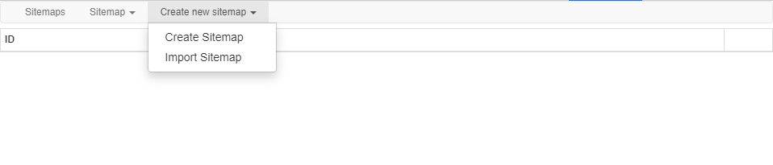
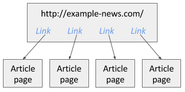

# 基本流程

## 安装和打开
Web Scraper 为 Chrome 浏览器的插件，具体安装步骤请参考快速上手中的 [Web Scraper 如何安装？](/guide/#web-scraper-如何安装？)

Web Scraper 集成在 Chrome 的开发者工具中，下图显示了如何打开开发者工具，也可以使用快捷键：
- windows、linux：Ctrl+Shift+I 或 F12
- mac：Command+Option+I

## 界面
Web Scraper 这个插件的界面由 3 个选项卡组成，具体结构和功能说明如下：

::: tip
sitemap 一词直译是**网站映射**，意思是把网站结构用另一种形式描述出来，更通俗的解释就是古装片里扎小人会用一个木头小人来代表某个活人，这就相当于把活人映射到小木人上，扎哪哪疼。在 ws-tricks 里我将 sitemap 意译为**抓取配置**，即一个 sitemap 就是针对某个网站的一种抓取配置，理解起来更容易些。
:::

### Sitemaps 选项卡

Sitemaps 选项卡会列出已有的抓取配置，显示配置 ID 以及启动链接，点击最后的 `Delete` 按钮可以删除配置。

### Sitemap 选项卡

在 Sitemaps 选项卡点击某个抓取配置或创建了新的抓取配置后会自动跳到这个选项卡，选项卡名称上会显示该配置的 ID（例如下图的 `weibo_general_search`），点击选项卡会展开菜单，可以对配置进行修改以及执行操作，包括：
- Selectors —— 对选择器进行编辑、删除和预览
- Selector graph —— 以图形化的方式展示选择器的组合关系
- Edit metadata —— 编辑抓取配置的元数据（ID 和启动链接）
- Scrape —— 启动抓取的核弹按钮
- Browse —— 浏览该配置已抓取的数据
- Export Sitemap —— 以 JSON 格式导出抓取配置
- Export data as CSV —— 以 [CSV](https://baike.sogou.com/v249053.htm?fromTitle=CSV) 格式导出已抓取的数据

### Create new sitemap 选项卡

显而易见，这个选项卡的两个菜单功能分别是创建空白的抓取配置和导入已有的抓取配置。

## 抓取
### 创建抓取配置
创建抓取配置的第一件事是指定启动链接，爬虫会从这个链接开始后续操作。如果需要从多个页面开始抓取，也可以指定多个启动链接，比如要抓取多个关键词的搜索结果时，就可以将各个搜索结果页添加进来作为启动链接，具体设置可以参考[官方教程#1——快速上手](https://www.bilibili.com/video/av55260570/)

### 带范围定义的启动链接
当一个网站的页面地址包含页码时，使用一个带范围定义的启动链接比使用链接选择器进行导航要简单得多，只需将链接中的数字部分替换为 [1-100] 这样的范围定义，如果页码本身包含了 0 占位填充，比如页码一定是三位数，不够时需要在前面加一到两个 0 ，则范围定义相应修改为 [001-100]，如果希望跳过其中的某些页面，可以在定义里增加步进值，比如 [0-100:10]，实际效果如下：
- **http://example.com/page/[1-3]**
    - http://example.com/page/1
    - http://example.com/page/2
    - http://example.com/page/3

- **http://example.com/page/[001-100]**
    - http://example.com/page/001
    - http://example.com/page/002
    - http://example.com/page/003

- **http://example.com/page/[0-100:10]**
    - http://example.com/page/0
    - http://example.com/page/10
    - http://example.com/page/20

### 创建选择器
下一步是创建选择器，在 `Selectors` 面板里可以增加、修改选择器以及在选择器树的不同层级中进行导航，Web Scraper 也将按照选择器树里的上下层级关系安排每个选择器执行的先后顺序。举个栗子，下面是一个新网网站，需要抓取首页上显示的所有文章：

创建一个链接选择器提取首页中所有文章的链接，然后在这个链接选择器下增加一个作为子选择器的文本选择器，它将负责提取文章内容：

::: tip
在创建选择器的过程中，注意使用元素预览（Element preview）和数据预览（Data preview）功能来确保选中了正确的元素和数据。更多关于构建选择器树的内容请阅读[选择器](/tutorial/selector.html)章节，至少要了解这些核心选择器：
- [文本选择器](/tutorial/text-selector.html)
- [链接选择器](/tutorial/link-selector.html)
- [元素选择器](/tutorial/element-selector.html)
:::

### 检查选择器树
完成选择器的创建后，可以通过选择器示意图（Selector graph）面板来检查选择器树的结构：

### 开始抓取
打开抓取（Scrape）面板开始抓取，将弹出一个新窗口，爬虫会在其中加载页面并提取数据，抓取完成后窗口会自动关闭并弹出消息通知抓取已完成，在浏览（Browse）面板可以查看抓取到的数据，如果需要导出数据则在导出（Export data as CSV）面板操作。