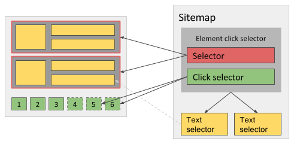

# 元素点击选择器
元素点击选择器与[元素选择器](/tutorial/element-selector.html)相似，区别是它可以通过点击按钮与网页进行交互从而触发新元素的加载，适用于使用 Javascript 和 AJAX 进行分页或元素加载的场景。

::: tip 
当选择可点击元素时，应当将鼠标移动到该元素上并按下 `S` 键，避免触发按钮上的点击事件。
:::

## 配置选项
- 选择器（selector）—— 用于定位作为父元素的包裹元素。
- 点击选择器（click selector）—— 用于定位会触发加载更多元素的按钮。
- 点击类型（click type）—— 决定选择器点击一次或多次，根据实际情况选择：
    - 点击一次（click once）表示只会点击相同按钮一次，如果出现了不同的新按钮，那它仍然会被点击，例如分页链接一开始只显示了 1-5 页，随着翻页的进行 6-10 页的链接按钮会逐步出现，选择器同样会点击它们。
    - 点击多次（click more）表示选择器会多次点击选中的按钮直到没有新元素出现，新元素指包含不同文本内容的元素。
- 点击元素唯一性（click element uniqueness）—— 用于区分按钮是否被点击过：
    - 文本唯一（Unique Text）表示按钮元素内的文本一致时当作是相同按钮，通常用这个就足够了。
    - HTML + 文本唯一（Unique HTML+Text）表示按钮元素的 HTML 和内部文本一致时当作是相同按钮
    - HTML 唯一（Unique HTML）表示按钮元素的 HTML 一致时当作是相同按钮。
    - CSS 选择器唯一（Unique CSS Selector）表示按钮元素的 CSS 选择器一致时当作是相同按钮。
- 多选（multiple）—— 通常都应该勾选，不然就必要用这个选择器了。
- 延迟（delay）—— 开始选择元素以及两次点击之间的等待时间，通常都需要设置，因为数据不可能在页面滚动之后立刻就从服务器返回并加载，如果不希望丢失数据的话最好设置成 2000 毫秒以上。
- 丢弃首批元素（Discard initial elements）—— 决定是否返回在第一次点击前就出现在页面上的元素：
    - 从不丢弃（Never discard）—— 保留第一次点击前的数据。
    - 存在点击元素时丢弃（Discard when click element exists）—— 如果存在点击元素，就丢弃第一次点击前的数据。
    - 总是丢弃（Always discard）—— 总是丢弃第一次点击前的数据（不推荐，只在上一个选项不起作用时使用）。

## 用例
### 翻页列表
假设网站包含商品列表并且底部有分页按钮，点击按钮后商品会动态地改变（地址栏的 url 不发生变化），使用元素点击选择器分别选中商品以及分页按钮，然后再添加子选择器提取数据，如下图所示：

### 点击加载更多列表
假设网站包含商品列表，不同的是更多商品是通过多次点击某个按钮持续加载的，这种情况需要将 `点击类型` 设为 `点击多次`：

