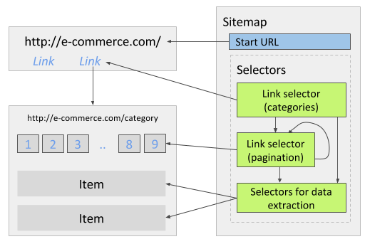

# 链接选择器
链接选择器用于提取链接和网站导航，如果链接选择器下没有子选择器，那它只会提取链接本身的信息，如果有子选择器，那么爬虫会访问抓取到的链接页面，然后在其中执行子选择器。

::: warning
注意！链接选择器只作用于包含 `href` 属性的 `<a>` 标签，如果链接选择器没有按你的预期工作，可以尝试以下变通办法：
1. 检查浏览器地址栏中的 url 在点击链接后是否发生变化（只是 # 后的内容变化不算，这只是代表当前页面的定位锚点改变了），如果没有变化，那这个网站可能是使用了 [ajax](https://baike.sogou.com/v25064.htm?fromTitle=Ajax) 进行数据加载，这种情况应当使用元素点击选择器而不是链接选择器。
2. 如果点击链接后弹出了新窗口，那应该改用链接弹出选择器。
3. 这个网站可能用 Javascript 修改了 windows.location 属性从而改变浏览器地址栏里的 url，Web Scraper 目前无法处理这种通过脚本进行页面导航的情况。
:::

## 用例
### 多层级网站
电商网站通常包含 `分类 -> 子分类` 这样的多个层级，如果需要抓取所有分类中的数据，可以创建两个链接选择器，一个提取分类链接，另一个提取分类页面中的子分类链接，也就是说子分类的链接选择器应该作为分类选择器的子选择器，而最后负责提取数据的选择器则作为子分类选择器的子选择器。

### 分页处理
一个包含多个分类的电商网站，每个分类页面展示商品列表和分页链接，有部分分页不会显示出来（比如只能看到 1-5 页，而 6-8 页看不到）。首先可以创建抓取配置，访问每个分类页面并从中提取商品信息，当然目前它只能提取第一页里展示的商品，要从后面的分页（包括目前看不到的）提取到更多商品，需要创建一个链接选择器将分页链接选中，下图显示了这个链接选择器在抓取流程中该如何执行，它会访问抓到的分页链接并在其中继续抓取更多分页链接，不断重复这个称为**递归**的流程，实现这个效果需要将链接选择器的父选择器设为自己（也可以说是把自己设为自己的子选择器）。

