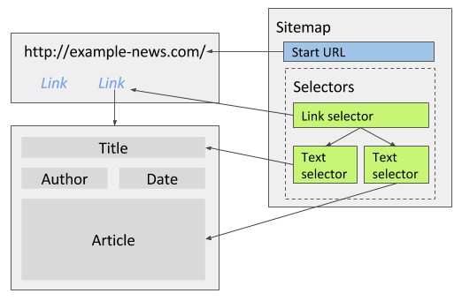
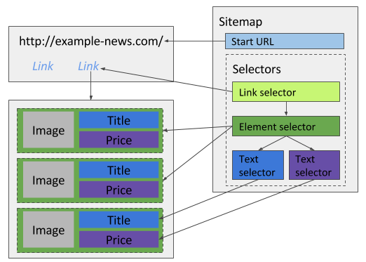
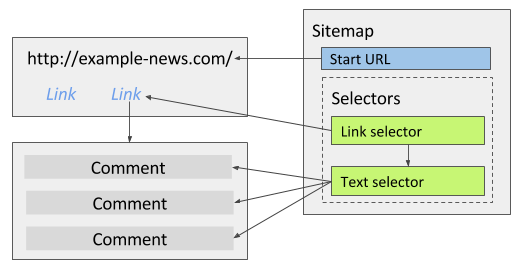

# 文本选择器
文本选择器用于从选中元素以及元素内所有子元素中提取出文本，HTML 代码会被去除，只保留文本。文本选择器会忽略掉 `<script>` 和 `<style>` 标签内的文本，` ` 会被替换成换行字符，此外还可以对返回数据应用正则表达式（regex）。

## 正则表达式
文本选择器有一个正则表达式（regex）配置选项，通过它可以抽取文本选择器所提取文本中的部分内容，返回结果是完整匹配的字符串（即 group 0 ），如果你完全看不懂前面在说什么的话，可以访问 [w3cschool](https://www.w3cschool.cn/zhengzebiaodashi/regexp-tutorial.html) 学习下正则表达式的相关知识。

几个栗子：
|原始文本|正则表达式|提取结果|
|:-|:-|:-|
|price: 14.99$|[0-9]+\.[0-9]+|14.99|
|id: H83JKDX4|[A-Z0-9]{8}|H83JKDX4|
|date: 2014-08-20|[0-9]{4}\-[0-9]{2}\-[0-9]{2}|2014-08-20|

## 用例
### 文章详情
新闻网站的文章详情页面包含标题、发布日期和作者，先使用一个链接选择器导航到每一篇文章的详情页面，然后用多个文本选择器分别提取标题、发布日期、作者和正文，**不需要勾选多选**，因为每一页只会提取出一条记录。

### 商品列表
电商网站通常有一个商品列表页面，在单个页面中列出了多个商品的简要信息，抓取时需要用一个元素选择器选中每个商品的包裹元素，然后在包裹元素下创建多个文本选择器提取商品预览图、标题和价格等信息。

### 文章评论
文章的评论区通常有展示多条评论，如果只需要抓取评论内容，可以使用文本选择器同时选中多条评论内容**并勾选多选选项**；如果需要提取其他评论相关的属性（比如评论人、评论时间等），请参考上面商品列表的例子。

